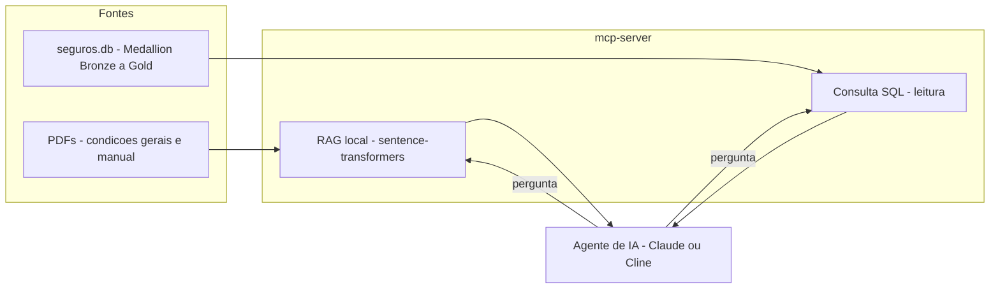

# Vivaz Chatbot - Insurtech RAG + SQL via MCP

Assistente de IA para uma seguradora fictícia que cruza duas fontes de contexto bem diferentes -
**documentos em PDF** (condições gerais, manual do segurado) e um **banco de dados estruturado**
(apólices, sinistros) - através do **MCP (Model Context Protocol)**, rodando 100% local.

## O que ele faz de diferente

Qualquer chatbot responde uma pergunta de PDF, ou uma pergunta de SQL. O diferencial aqui é
cruzar as duas sem que ninguém precise dizer onde procurar:

> **Pergunta:** *"Quantos sinistros de roubo foram avisados fora do prazo que o contrato exige?"*
>
> Pra responder, o agente precisa: (1) achar o prazo certo nas condições gerais em PDF - que
> varia por tipo de apólice -, (2) cruzar com a data de ocorrência x data de aviso no banco, e
> (3) fazer a matemática certa por tipo. Ele também sinaliza sozinho os casos que **não dá pra
> confirmar** por dado inconsistente na origem, em vez de forçar uma resposta.

## Arquitetura

## Governança de dado, não só resposta bonita

O pipeline de dados (`data-pipeline/`) segue arquitetura Medallion e **não esconde dado ruim
atrás de `NULL`**: inconsistências (datas nulas, zeradas, com mês/dia impossível, valores pagos
negativos, sinistros sem apólice válida) ficam marcadas explicitamente com o prefixo
`INCOSISTENTE: ...`, direto na coluna - e são automaticamente excluídas de KPIs financeiros e
cálculos de prazo, sem precisar de tratamento manual a cada consulta. Ver
[`data-pipeline/README.md`](data-pipeline/README.md) para detalhes.

## Estrutura do projeto

- [`mcp-server/`](mcp-server/) - servidor MCP: RAG sobre PDFs (embeddings locais) + consultas SQL de leitura.
- [`data-pipeline/`](data-pipeline/) - pipeline de dados em arquitetura Medallion (Bronze → Silver → Gold)
  e o banco `seguros.db` que o servidor consulta.

Veja o README de cada pasta para detalhes de setup, tools expostas e como rodar localmente.

## Stack

Python · SQLite · MCP (Model Context Protocol) · sentence-transformers (embeddings locais) · pypdf · pytest · GitHub Actions

---

*Todo o dado - apólices, sinistros e condições contratuais - é 100% sintético/fictício, criado para fins de estudo.*
